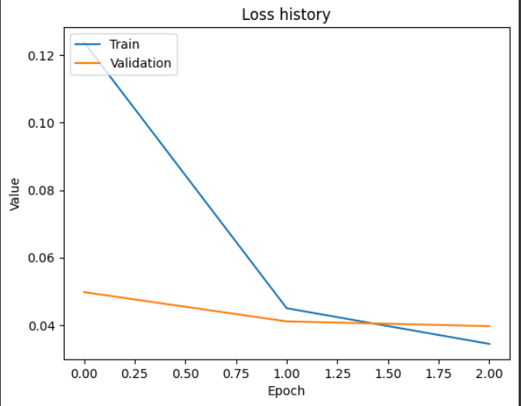
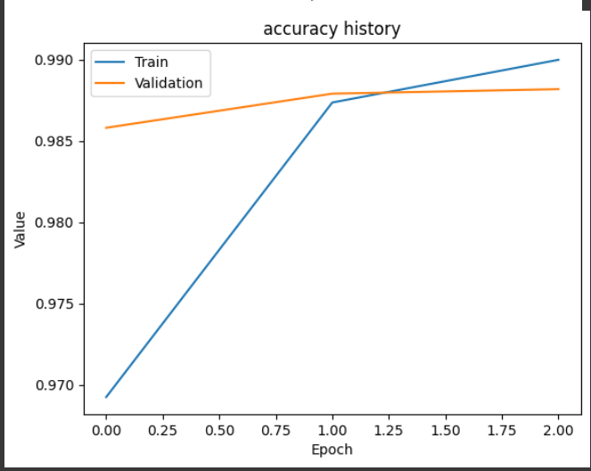

# NER App

## Description
This project consists of my own NER (**Named-entity recognition**) model, api and web app. Model has been trained on **namanj27/ner-dataset** from **Kaggle**.

[](https://www.youtube.com/watch?v=ft5DCTRl4Ck)

## Project Structure
```
├───api/
│   ├───logs/
│   ├───__init__.py
│   ├───routes.py
│   ├───run.py
│   └───uvicorn_log_config.json
├───models/
├───web_app/
│   ├───logs/
│   ├───static/
│   │   ├───images/
│   │   ├───styles/
│   ├───temp/
│   ├───templates/
│   ├───__init.py__
│   ├───.env
│   ├───clear_temp_files.py
│   ├───forms.py
│   ├───routes.py
│   └───run.py
├───config.py
├───custom_decorators.py
├───custom_logger.py
├───predictor.py
├───README.md
└───requirements.txt
```

## Packages
```
fastapi==0.115.5
Flask==3.1.0
flask_wtf==1.2.2
nltk==3.9.1
numpy==1.26.0
pydantic==2.14.6
python-dotenv==1.0.1
Requests==2.32.3
tensorflow==2.17.0
tensorflow_intel==2.17.0
uvicorn==0.32.0
WTForms==3.2.1
```

## Setup
  - install python 3.11+ (version I use)
  - ```pip install -r requirements.txt```

## Model Architecture
Input for that model is text transformed into sequence of word indexes and returns sequences of probabilities for each tag (entity).

### Parameters:
 - embedding_dim: `int`
 - vocab_size: `int`
 - tagset_size: `int`
 - lstm_units: `int`
### Layers
 - **Embedding** - converts sequences to dense vectors with the size of `embedding_dim`.
 - **Bideractional LSTM** - first layers has `lstm_units` of units, and second one has `lstm_units // 2`. Both of them have `return_sequences=True`, `dropout=0.3`, `recurrent_dropout=0.3`. LSTM is used here to work with sequences, traning time was quite short, so no need for **GRU**.
 - **Dropout** - 0.5 dropout.
 - **TimeDistributed Dense** - final layer with softmax for each word in sequence, predicts the probability distribution across all possible tags (`tagset_size`).

### Compile 
Adam optimizer with **sparse categorical crossentropy** loss function.

```python
def build_model(vocab_size: int, tagset_size: int, embedding_dim: int, lstm_units: int) -> keras.Model:
    model = tf.keras.Sequential([
        # embedding - converts words indexes to vectors
        tf.keras.layers.Embedding(
            input_dim=vocab_size,
            output_dim=embedding_dim,
        ),

        tf.keras.layers.Bidirectional(
            tf.keras.layers.LSTM(
                lstm_units,
                return_sequences=True,
                dropout=0.3,
                recurrent_dropout=0.3
            )
        ),

        tf.keras.layers.Bidirectional(
            tf.keras.layers.LSTM(
                lstm_units // 2,
                return_sequences=True,
                dropout=0.3,
                recurrent_dropout=0.3
            )
        ),

        tf.keras.layers.Dropout(0.5),

        # TimeDistributed - dense with softmax for each word
        tf.keras.layers.TimeDistributed(
            tf.keras.layers.Dense(tagset_size, activation="softmax")
        )
    ])

    model.compile(
        optimizer="adam",
        loss="sparse_categorical_crossentropy",
        metrics=["accuracy"]
    )
    return model
```


## Model training results
### Loss history

Loss value for both train and validation dropped instantly after just 1 epoch, but validation loss is more stable and started from lower value. After few more epochs loss values started to flatten dropping below 0.04.

### Accuracy history

Accuracy for both train and validation was high from the beggining.

## Validation on test data
To calculate accuracy on test data I was checking results with margin error with value of 2, that means max 2 tags in a sequence can be wrong but will be counted as correct prediction.
The result was **89.40783986655546**.
```python
margin_error = 2

predictions = model.predict(X_test)
predicted_tags_ids = np.argmax(predictions, axis=-1)

true_false_matrix = (predicted_tags_ids ==y_test)
correct_per_sample = np.sum(true_false_matrix, axis=1)

sequence_lengths = np.array([len(label) for label in y_test])
errors_per_sample = sequence_lengths - correct_per_sample

succeeded = np.sum(errors_per_sample <= margin_error)
failed = len(X_test) - succeeded

test_accuracy = (succeeded / len(X_test))  * 100
print(test_accuracy)
```

### Config
**config.py** is a configuration file...you can configurate stuff there

### Predictor
Predictor (**predictor.py**) - class for making prediction and decoding and stuff :P.

#### **Init parameters**
  - **model_path**: `Path` - path to model (notebook saves this)
  - **word2idx_path**: `Path` - path to word to index mapping (notebook saves this)
  - **idx2tag_path**: `Path` - path to index to tag mapping (notebook saves this)
  - **max_len**: `int` - max len of sequences, the same as in training

#### **Methods**
#### `tokenize_sentence`:
Static method for word tokenizing sentences.
- **parameters**:
  - sentence: `str`
- **returns**
  - tokenized sentence - list of words: `List[str]`

#### `encode_data`:
Method for preprocessing string data.
- **parameters**:
  - sentence: `str`
- **returns**
  - list of word ids with padding and tokens: `Tuple[List[int], List[str]]`

#### `get_predictions`:
Main method for getting final results.
- **parameters**:
  - texts_list: `str` - list of sentences
- **returns**
  - list of pairs **word: tag** for each sentence and list of tokenized sentences: `Tuple[List[List[Tuple[str, str]]], List[List[str]]]` 

#### **Example**
```python
ner_pred = NerPredictor(
    model_path="",
    word2idx_path="",
    idx2tag_path="",
    max_len=Config.MAX_LEN
)
x, y = ner_pred.get_predictions(
    texts_list=["The FBI's has opened an investigation against former FBI and CIA directors. Russian interference in the US election is in the background. Conference will start at 20.07.2025"]
)
print(x)
print()
print(y)
```

### API
Fast api with few endpoint, see docs: **/docs**.

#### **Endpoints**
 - **/**: `get` - just to check if api is running
 - **/health** - `/get` - some healt check but it doesn't have much value, it has hardcoded status xd - didn't see a reason to add sth more
 - **/get_ner_prediction** - `post` - main endpoint for making predictions, requires list of text (`list[str]`) and sent_tokenizer (`bool`), if True then it will tokenize your text into sentences
 ```python
 data = {
    "text_list": ["some text. some text"],
    "sent_tokenizer": True
}
resp = requests.post(f"{Config.API_URL}/get_ner_prediction", json=data)
data = resp.json()
 ```

### Web App
Web application for all of these stuff, you can see how it works and what it does in the video, so tbh I dunno even care about typing more, it's late and nobody even gonna read that crap, just wanna say that form is kinda bugged (csrf tokens seem kinda fucked in async flask :PPPPPPPPP)